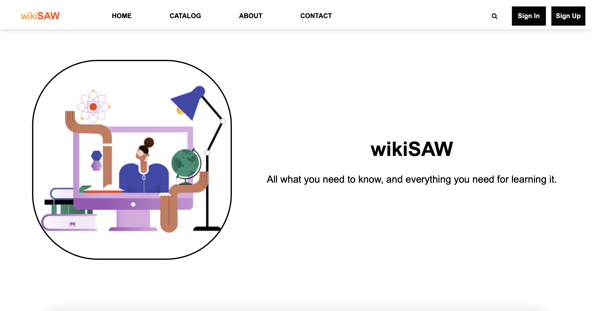
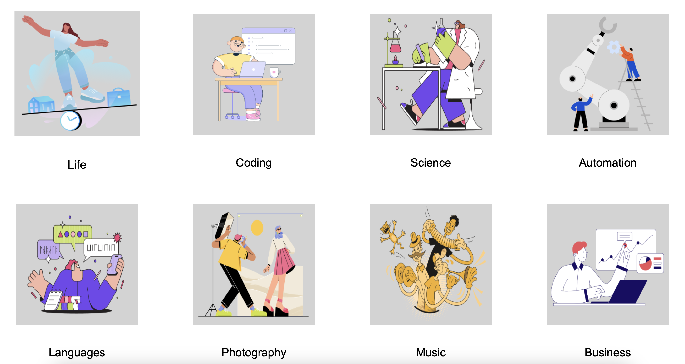
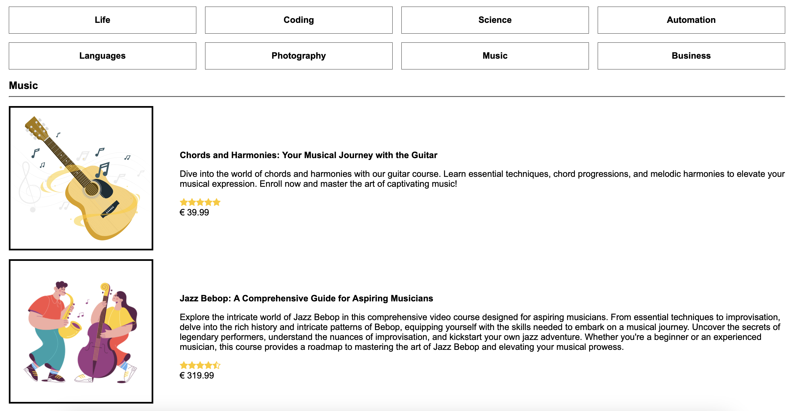
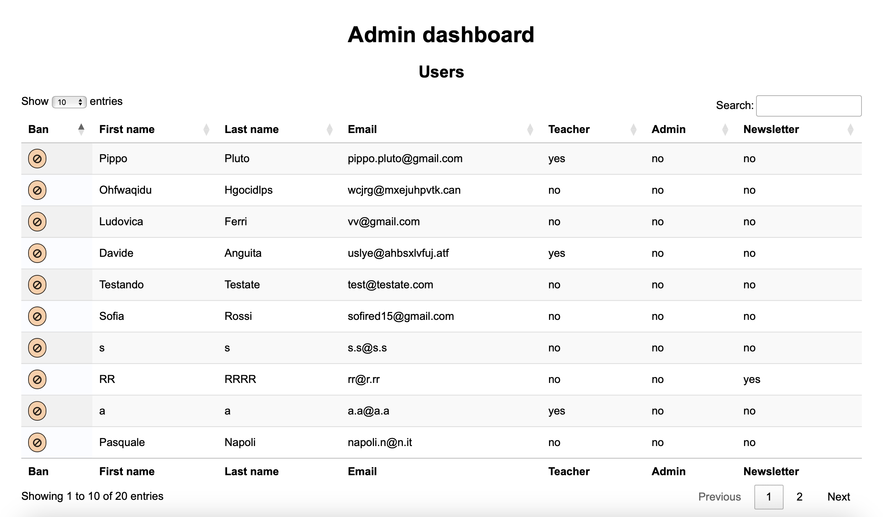
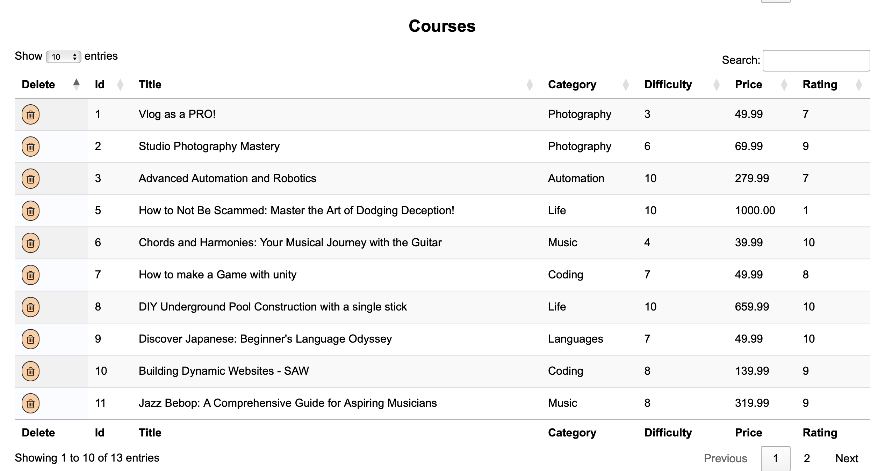
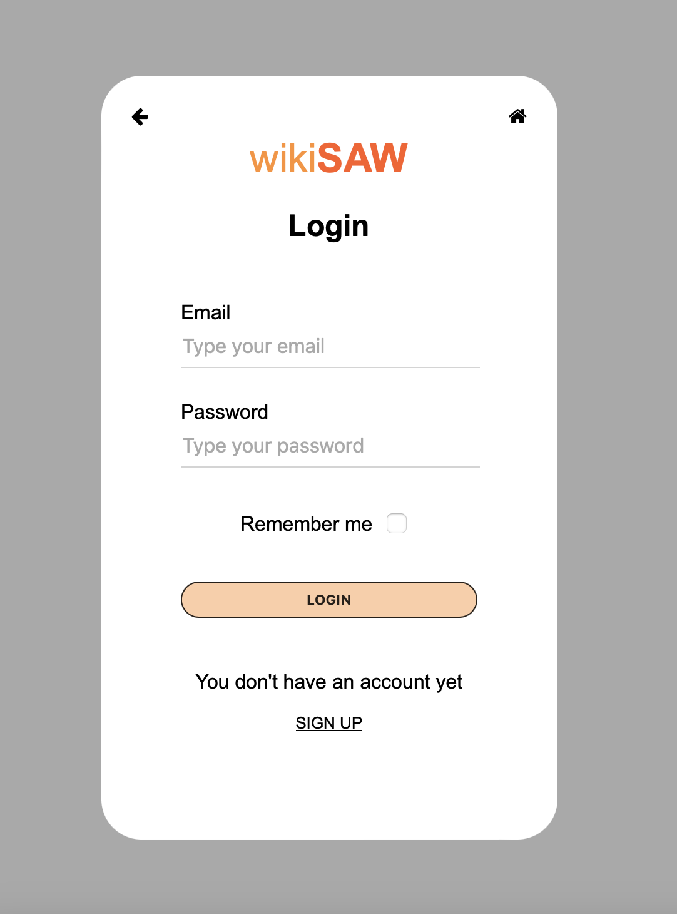
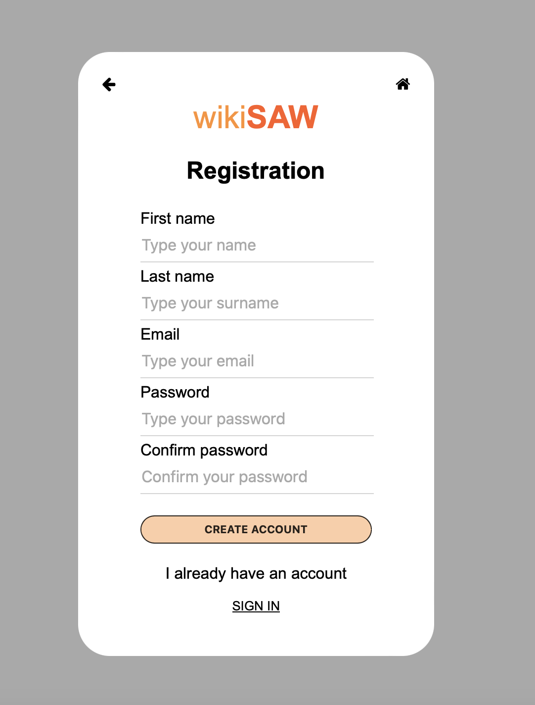
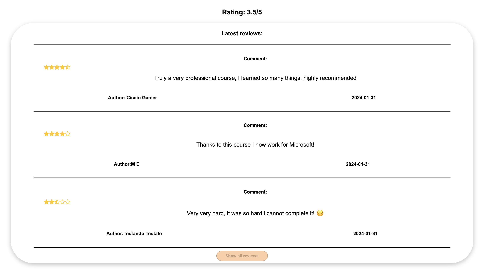
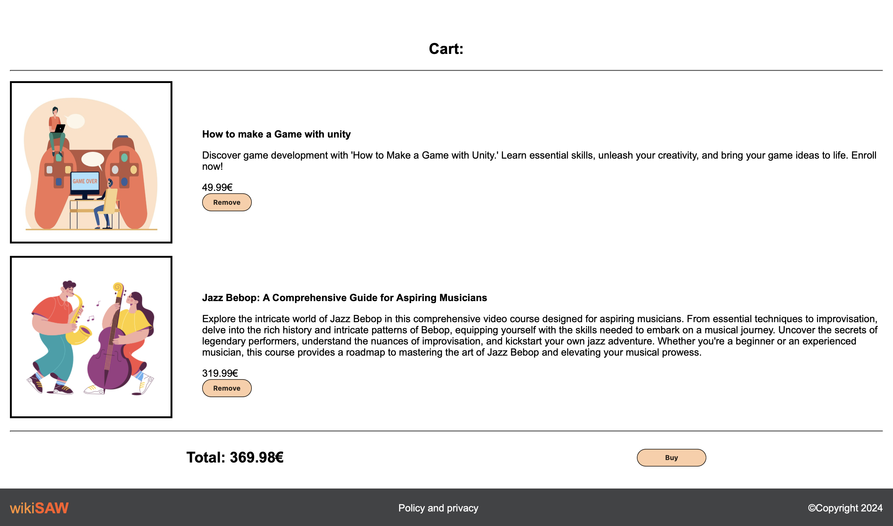

# WikiSAW

Welcome to **WikiSAW**, a web platform that allows users to buy and sell courses based on their roles—either as a regular customer or as a teacher. This project was developed as part of the "Sviluppo di Applicazioni Web" course at University of Genoa.

Below you will find an overview of the project's features, technologies used, and how to get started.

For a proper presentation we suggest to view [WikiSAW PDF](README_assets/WikiSAW.pdf)

* Please note that this project was created solely for _academic purposes_.

## Features

### User Roles
- **Customer**: Browse, purchase, and review courses. Manage your profile with ease and track your learning progress.
- **Teacher**: Upon upgrading to a teacher account, gain access to a professional dashboard where you can manage and publish your own courses.
- **Admin**: Administrators have a dedicated dashboard to manage all users and courses within the platform.

### Core Functionalities
- **Home Page**: Provides an overview of the platform, showcasing popular courses and key features.
- **Course Catalog**: A comprehensive list of courses categorized by topic, making it easy for users to find the content they are interested in.
- **About and Contact Pages**: Information about the platform and ways to get in touch with the team.
- **Shopping Cart**: Customers can add courses to their cart and proceed to purchase them through a streamlined checkout process.
- **Reviews**: Users can leave feedback on purchased courses, helping others make informed decisions.
- **Admin Area**: A dedicated area for administrators to manage the platform’s content and users effectively.
- **Teacher Area**: A personalized dashboard for teachers to manage their course offerings, track sales, and interact with students.

## Technologies Used

### Front-End
- **HTML5**: Structuring and presenting content on the web pages.
- **CSS3**: Styling the website, ensuring a responsive and user-friendly design.
- **JavaScript**: Adding interactivity and enhancing the user experience.

### Back-End
- **PHP**: Server-side scripting, handling requests, and managing backend logic.
- **MySQL**: Database management, storing user information, course data, and transactional records.
---

### Home

  
  

---

### Course catalog

---

### Dashboards

  
  

---

### Sign in & Sign up

  
  

---

### Cart & Course reviews

  
  

---
## Link
The website is now accessible and can be visited at the following link:

[Visit now WikiSAW](https://saw21.dibris.unige.it/~S5187919/php/home.php)
